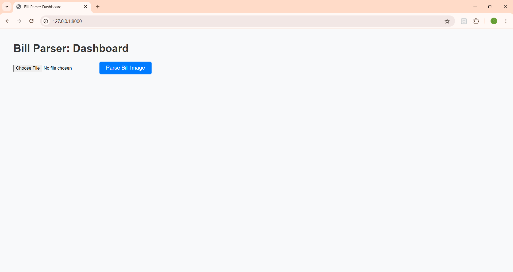
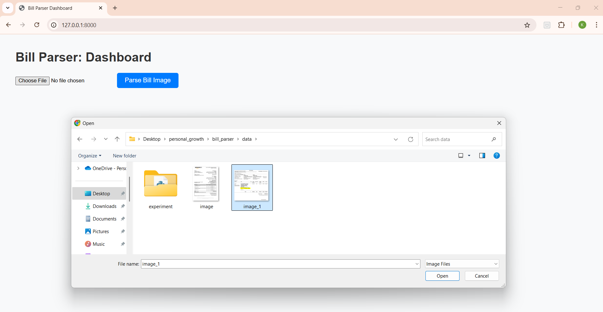
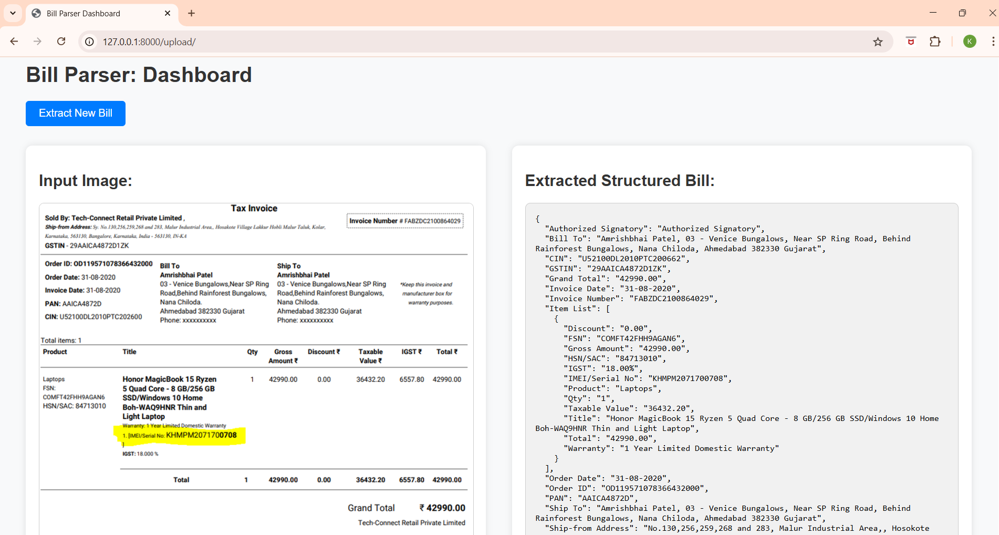

# Bill Parser 🚀

# 🌟**Project Highlights**

This project uses **Generative AI (GenAI)** to extract structured data from  **images of purchase bills** , helping e-commerce analytics organizations generate actionable insights.

```markdown
✅ Parses unstructured bill images into structured formats (e.g: JSON)
✅ Uses state-of-the-art GenAI models (OpenAI or open-source)
✅ Provides an interactive dashboard for uploading and processing bills
```

# Installation Guide

## Clone the Repository:

```env
git clone 
cd bill_parser
```

## Create a Virtual Environment & Install Dependencies

✅ **Windows**

```bash
python -m venv venv
venv\Scripts\activate  # On Windows
pip install -r requirements.txt
```

✅ **Mac/Linux**

```bash
python3 -m venv venv
source venv/bin/activate
pip install -r requirements.txt  
```

# **How to Run the App**

## 1. Get API Keys

- **OpenAI API Key:** Get your API key from [OpenAI](https://platform.openai.com/)

## 2. Set API Keys

Create a `.env` file inside the directory and add your API keys.

1. OPENAI_API_KEY

```bash
OPENAI_API_KEY="your_openai_key"
```

## 3. Launch the dashboard:

✅ **Windows**

```bat
scripts\run.bat
```

✅ **Mac/Linux**

```bash
./scripts/run.sh
```

✅ **Alternatively (All platforms)**

If you prefer not to use the scripts, you can run the app manually:

```python
uvicorn src.ui.main:app --reload 
```

## 4. Access the Dashboard

### Step 1:

Open [http://127.0.0.1:8000](http://127.0.0.1:8000) in your browser.



### Step 2:

Upload a bill image and click on  **"Parse Bill Image"** .



### Extracted Output:



### 📹 Demo Video

[DEMO VIDEO LINK](image\README\Demo Document Parser.mp4)

## 👨‍💻About Me

```markdown
Hi, I'm Krishna Jajoo, a Data Scientist passionate about **AI-driven information extraction** and **knowledge automation**.  
My expertise includes **Gen-AI, NLP, and knowledge graphs**, enabling me to build intelligent systems.  

- **💼 Experience:** Data Scientist at Drishya AI Labs  
- **🛠 Skills:** Python, Prompt Engineering, Neo4j, LangChain, OCR  
- **🚀 Interests:** AI/ML, NLP, Generative AI  

📫 **Let's connect:**  
- [LinkedIn](https://www.linkedin.com/in/krishna-jajoo-59a4951b4)  
- [GitHub](https://github.com/krishna-jajoo)  
- 📧 Email: krishnajajoo09@gmail.com  
```
